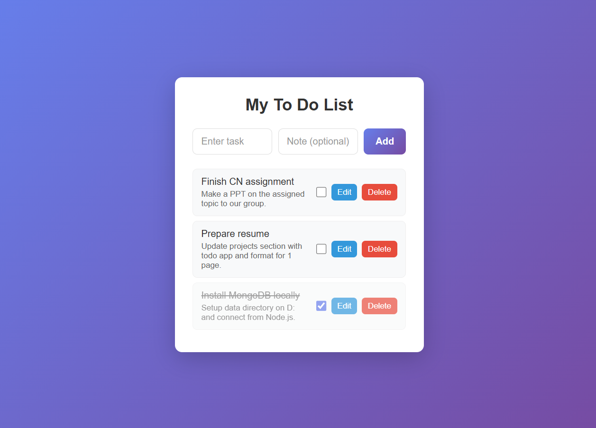

# Todo Fullstack (Node + MongoDB)

A simple full‑stack todo app using Node.js, Express, MongoDB (Mongoose) and plain HTML/CSS/JS.

## Features

- Add tasks with title and optional description
- List all tasks from MongoDB
- Mark tasks as completed
- Edit existing tasks (title + description)
- Delete tasks
- Clean, responsive UI with a gradient background

## Tech Stack

- **Backend**: Node.js, Express, Mongoose
- **Database**: MongoDB
- **Frontend**: HTML, CSS, vanilla JavaScript (Fetch API)

## Getting Started

### Prerequisites

- [Node.js](https://nodejs.org/) (LTS recommended)
- [MongoDB Community Server](https://www.mongodb.com/try/download/community)

MongoDB should be running locally on:

- `mongodb://127.0.0.1:27017/todoDB`

### Installation

```bash
git clone https://github.com/neelwankhade007-rgb/todo-fullstack-nodejs-mongodb.git
cd todo-fullstack-nodejs-mongodb
npm install
```

### Run the app

Make sure MongoDB is running (for example on your machine: `mongod --dbpath D:\data\db`), then:

```bash
npm start
```

Open in your browser:

```text
http://localhost:3000
```

## Screenshot



## API Overview

Base URL: `http://localhost:3000`

- `GET /tasks` – Get all tasks
- `POST /tasks` – Create a task  
  Body:

  ```json
  {
    "title": "Task title",
    "description": "Optional description"
  }
  ```

- `PUT /tasks/:id` – Update a task (title, description, or completed)
- `DELETE /tasks/:id` – Delete a task

## Project Structure

```text
.
├─ public/
│  ├─ index.html      # Frontend UI
│  ├─ style.css       # Styling
│  └─ script.js       # Frontend logic (fetch API, DOM updates)
├─ models/
│  └─ Task.js         # Mongoose Task model
├─ server.js          # Express server and routes
├─ package.json
└─ .gitignore
```